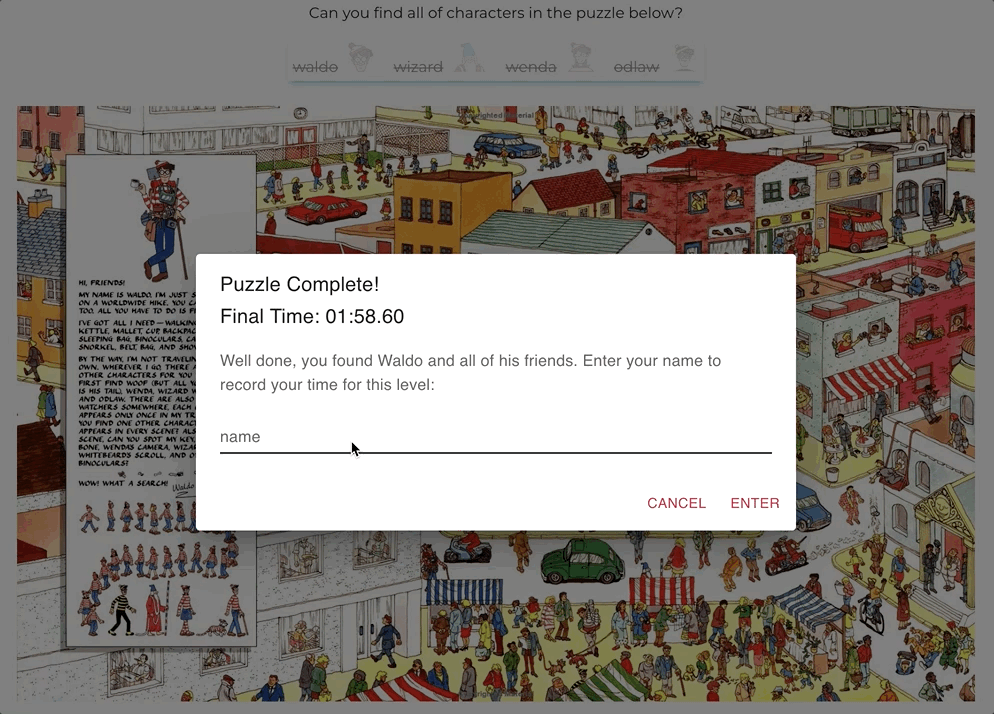
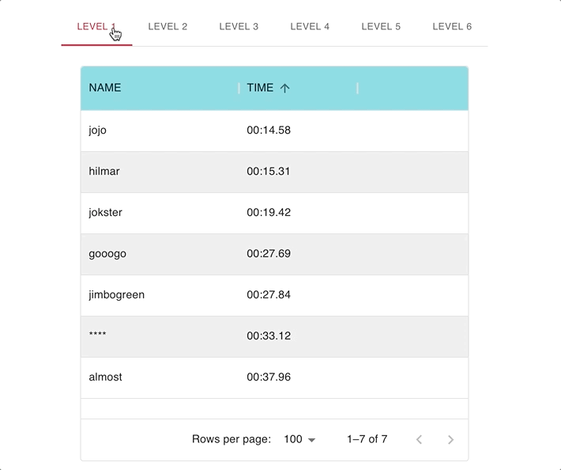
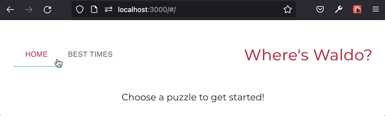

# Where's Waldo?

See a project demo [here](https://dwgrossberg.github.io/where-is-waldo/) :point_left:

This app is based on the classic children's puzzle book game [Where's Waldo](https://en.wikipedia.org/wiki/Where%27s_Wally%3F).

## Tech Stack

- Written in vanilla [JavaScript](https://www.javascript.com/)
- Built using [React](https://www.javascript.com/) and [MUI React Components](https://mui.com/)
- Back-end implemented via [Firebase](https://firebase.google.com/)
- Tested with [Jest](https://jestjs.io/)

## Key Features

- 6 unique levels, each with 4 characters to find
  
- Writes user info (name and time) to Cloud Firestore after each level is complete
  
- Best Times scoreboards for each level display real-time user data
  
- Routing handled with React-router-dom
  
- A user-friendly DOM puzzle magnifying glass
  
- Responsive / mobile-friendly design
  
- Real-time character hit/miss feedback
  
- Explicit user names filtered out with the help of [bad-words](https://www.npmjs.com/package/bad-words)
  
- Written using functional components and hooks

## Objectives

My goal for this project was to build a full-stack photo-tagging app, while learning to work with a BaaS provider like Firebase. As a secondary goal, I wanted to create a relatively complex app that would tie together everything I've been learning about React over the past several months.

## Challenges

The biggest challenges for this project were simply getting familiar with several new pieces of technology at once - mainly Firebase and MUI - and implementing them smoothly into the project. Lots of documentation!
